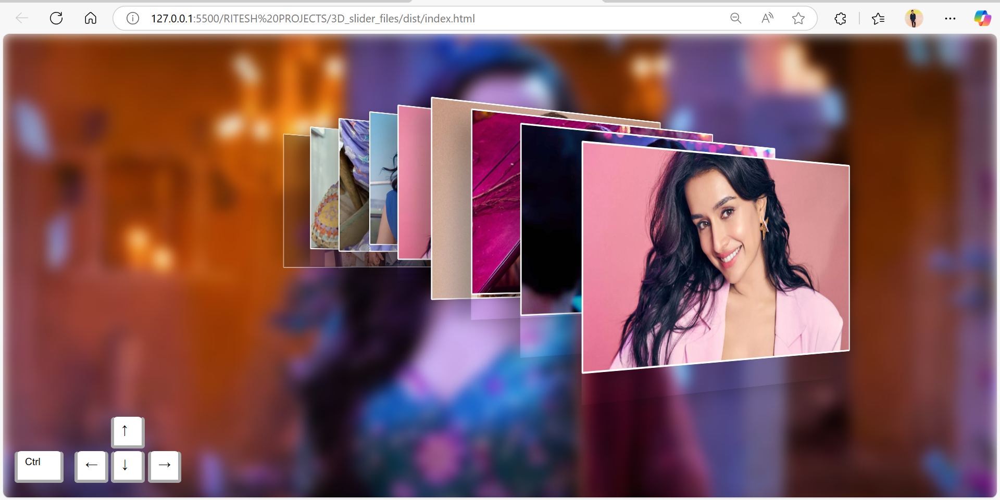

**# 🖼️ 3D Stacked Card Image Slider ✨**

Welcome to the 3D Image Slider Webpage repository! This project showcases a sleek and interactive 3D image slider for modern web pages. Perfect for portfolios, galleries, or any visual showcase.

This project showcases a visually appealing 3D stacked card image slider, created using HTML, CSS, and JavaScript (jQuery). It mimics the classic Windows 7 Aero task-switcher effect, allowing users to cycle through a gallery of images with a smooth, 3D animation.

The current gallery features images of the actress Shraddha Kapoor.

---

## 📸 3D Image Slider Homepage

---

## 🌐 Live Demo

[- 🔗 Click here to view the live site on Netlify](https://3dsliderimage.netlify.app/)

[- 🔗 Click here to view the live site on GitHub Pages](https://riteshraut0116.github.io/fruit_shop_website_html/)

---

## ✨ Features

*   **Interactive 3D Effect:** Cards are stacked in a 3D perspective.
*   **Keyboard Navigation:** Easily navigate through the cards using keyboard shortcuts.
*   **Smooth Animations:** Fluid transitions powered by modern CSS.
*   **Customizable:** Simple to replace images and customize the look and feel.

---

## 📂 Repository Structure

3D_IMAGE_SLIDER_WEBPAGE/
│
├── 3D_slider_files/
│   ├── dist/                # 📦 Production-ready files
│   │   ├── index.html       # 🧭 Main HTML file
│   │   ├── script.js        # ⚙️ JavaScript for slider logic
│   │   └── style.css        # 🎨 CSS styling
│   │
│   ├── images/              # 🖼️ Slider images
│   │   ├── 1.jpg
│   │   ├── 2.jpg
│   │   └── 3.jpg
│   │
│   └── src/                 # 🛠️ Development files
│       ├── index.html
│       ├── script.js
│       └── style.scss       # 💅 SCSS for advanced styling
│
├── LICENSE.txt              # 📜 License details
└── README.md                # 📘 Project documentation

---

## 🚀 How to Run

1.  Download or clone this repository to your local machine.
2.  Navigate to the `3D_slider_files/dist/` directory.
3.  Open the `index.html` file in any modern web browser (like Chrome, Firefox, or Edge).
4.  Use **Ctrl + ←** and **Ctrl + →** to cycle through the image cards!

---

## 💻 Technologies Used

*   **HTML5**
*   **CSS3**
*   **JavaScript**
*   **jQuery**

---

## 📄 License
This project is licensed under the terms in LICENSE.txt.

---

## 🤝 Contributing
Feel free to fork the repo, submit issues, or create pull requests. Contributions are welcome!

---

## 👤 Author

**Ritesh Raut**  
*Programmer Analyst, Cognizant*

Passionate about building practical and visually engaging web applications. This project reflects a blend of creativity, user experience, and technical implementation aimed at solving real-world problems in a simple and elegant way.

---

### 🌐 Connect with me:

---
